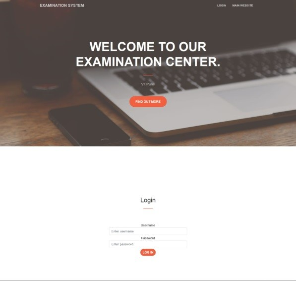

# Online Examination System

This is a DBMS(Database Management System) Course Project.
We had choosen this project because online examination system is in demand and it is neccessary for all institutes due to COVID-19.

Online examination system is a web-based examination system where examinations are given online through the internet using computer system.  The  main  goal  of  this  online  examination  system  is  to effectively evaluate the student thoroughly through a totally automated system that not only reduce the required time but also obtain fast and accurate results.  

We have used 3 Modules in our project.

    1. admin
    2. student
    3. faculty

1. Admin module:
        An admin performs the daily tasks that are required to maintain the website. They may also assist users who have trouble using the website.

2. Student module:
            This is an interface for student to register, edit profile, login, select exam, give exam, view the exam results and view answers of the questions.

3. Faculty module:
            This module handles all the students under the control of Admin.

## How to Run this project

In DBMS-CP.rar all the files are stored and outside files are for website which we created for our project.

For Admin:

    Username: admin
    Password: admin
  
For Student

    Username: Preeti
    Password: preeti
    
## Screenshot

